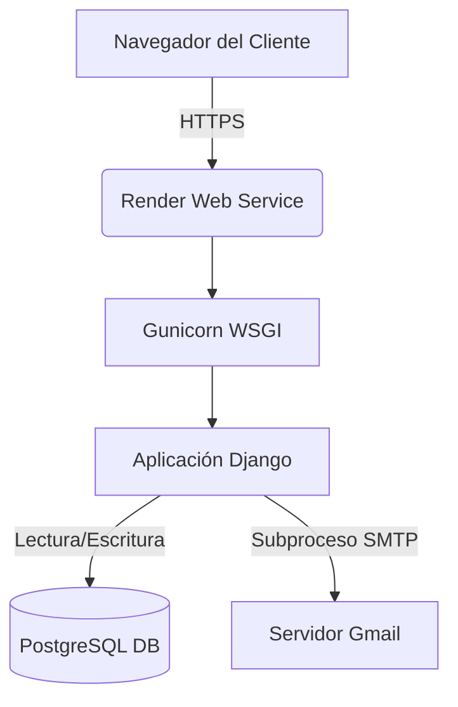
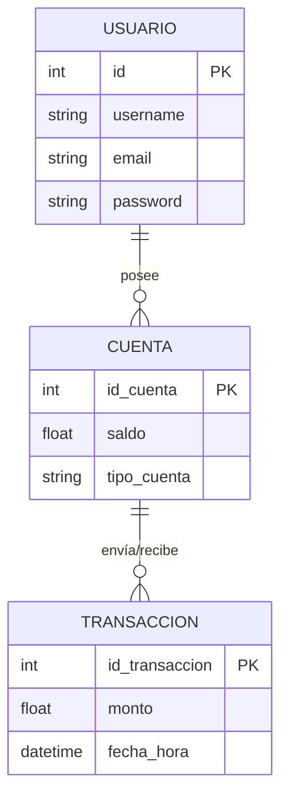
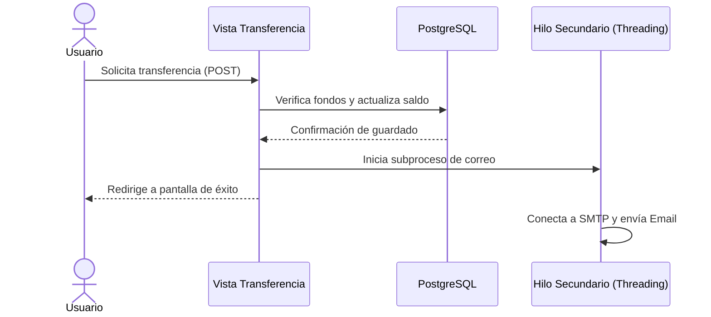

# 🏦 Banco2 - Sistema Bancario Web

## 📖 Descripción del Proyecto
Banco2 es una plataforma bancaria desarrollada con el framework web Django. El sistema permite la gestión de usuarios, la visualización de estados de cuenta y la ejecución de transferencias monetarias de forma segura.

El proyecto está diseñado para operar en la nube utilizando una base de datos persistente (PostgreSQL) e integra un sistema de notificaciones asíncronas por correo electrónico para alertar a los usuarios sobre eventos críticos, como nuevos inicios de sesión o transferencias realizadas.

---

## 🗺️ Diagramas del Sistema

### 1. Arquitectura de Despliegue
El proyecto sigue una arquitectura cliente-servidor alojada en la plataforma Render.



### 2. Modelo Entidad-Relación
Estructura relacional base para el control de los fondos de los usuarios.



### 3. Flujo Asíncrono de Notificaciones
Diagrama de secuencia de una transferencia y el envío del correo en segundo plano para evitar el bloqueo del servidor.



## 🚀 Cómo echar a andar el proyecto

### Requisitos Previos

- Git instalado en el sistema.
- Python 3.10+ para ejecución local o Docker Desktop para entornos contenedorizados.

### Opción A: Ejecución Local (Entorno Virtual)

1. **Clonar el repositorio:**

   ```bash
   git clone https://github.com/Che-0/Banco2.git
   cd Banco2
   ```

2. **Crear y activar el entorno virtual:**

   ```bash
   python -m venv venv
   source venv/bin/activate  # En Windows usar: venv\\Scripts\\activate
   ```

3. **Instalar dependencias:**

   ```bash
   pip install -r requirements.txt
   ```

4. **Configurar variables de entorno:**

   Crea un archivo llamado `.env` en la raíz del proyecto y agrega las credenciales necesarias. Asegúrate de que este archivo no se suba a GitHub.

   ```env
   SECRET_KEY=tu_clave_secreta_local
   DEBUG=True
   EMAIL_HOST_USER=tu_correo@gmail.com
   EMAIL_HOST_PASSWORD=tu_contrasena_de_aplicacion
   ```

5. **Aplicar migraciones y arrancar el servidor:**

   ```bash
   python manage.py migrate
   python manage.py runserver
   ```

El proyecto estará disponible en `http://127.0.0.1:8000/`.

### Opción B: Ejecución con Docker

Si prefieres aislar el entorno, puedes levantar el proyecto contenedorizado.

1. Si ya cuentas con un archivo `docker-compose.yml` en la raíz del proyecto, ejecuta:

   ```bash
   docker-compose up --build
   ```

2. Accede a `http://localhost:8000`.

